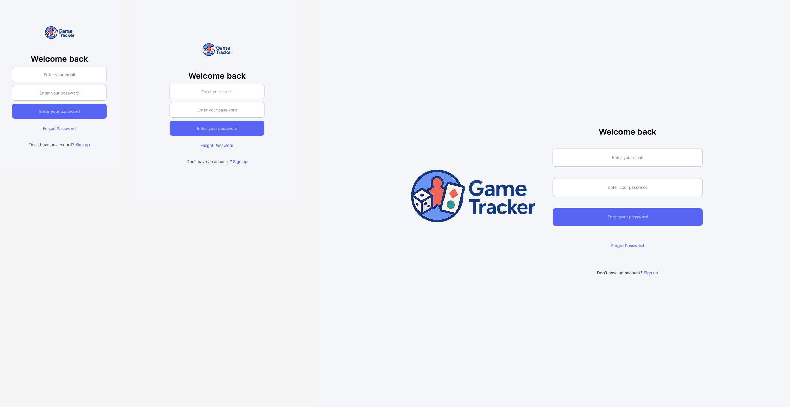
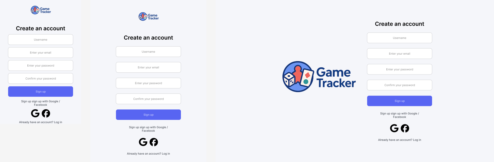
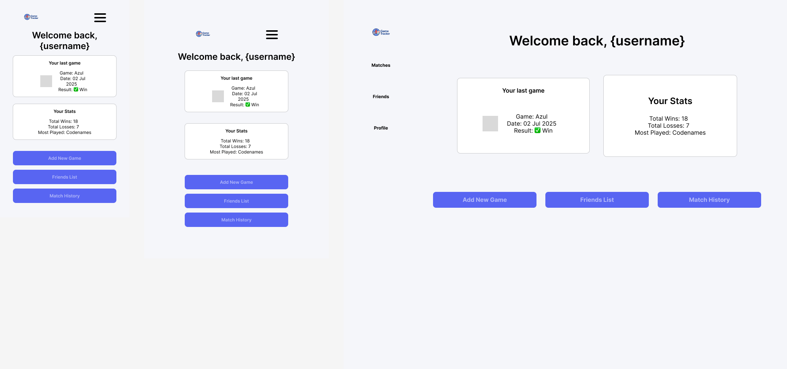
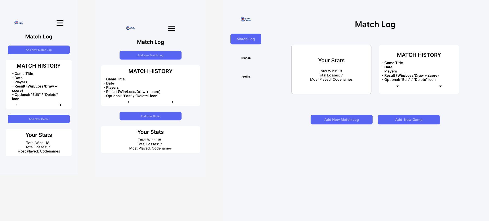
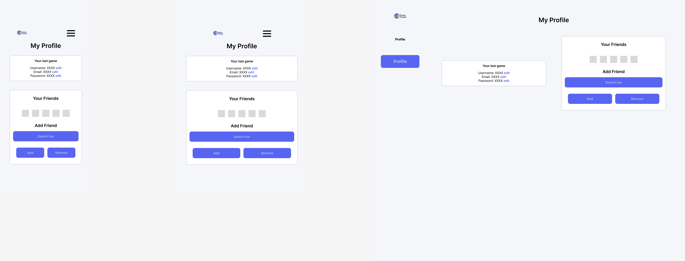

# 🎮 Game Tracker Frontend – React + Vite (Mobile First)

This is the frontend client for the [Game Tracker](https://github.com/gysagsohn/game-tracker-server) project — a full-stack MERN app to track wins, losses, and scores from card/board games. The frontend is built using React, Vite, and Tailwind CSS, with a mobile-first design philosophy.

---

## ⚙️ Tech Stack

- React (with Vite)
- Tailwind CSS
- Axios
- React Router
- Context API (planned)
- LocalStorage / JWT for auth

---

## 📁 Folder Structure

```bash
game-tracker-client/
├── public/
├── src/
│   ├── components/     # Reusable UI components
│   ├── pages/          # Route-based pages (Login, Dashboard, etc.)
│   ├── styles/         # Tailwind and custom CSS
│   ├── contexts/       # Global state (e.g., auth)
│   └── App.jsx         # Main app router
├── assets/
│   └── wireframes/     # Wireframe image files
├── index.html
├── tailwind.config.js
├── vite.config.js
```

## Wireframes
| Page        | Preview |
|-------------|---------|
| Login       |  |
| Signup      |  |
| Dashboard   |  |
| Match Log   |  |
| Profile     |  |


## Getting Started (Local Dev)

1. Clone the repo:
``` bash 
git clone git@github.com:gysagsohn/game-tracker-client.git
cd game-tracker-client
```

2. Install dependencies:
``` bash
npm install
```

3. Run the dev server:
``` bash
npm run dev
```

4. Create a .env file at the root:
``` bash
VITE_API_URL=http://localhost:3001
```
Make sure this matches the port your backend server is running on.

## Pages & Routes

| Route           | Description                                      |
|----------------|--------------------------------------------------|
| `/login`        | Login form with password reset option            |
| `/signup`       | Create new account (with social login placeholder) |
| `/dashboard`    | Welcome, stats, last game, nav buttons           |
| `/matches/new`  | Log a new game result                            |
| `/matches`      | Match history + stats                            |
| `/profile/:id`  | Edit profile, view/add friends (merged with Friends Page) |

---

## Components

- `Navbar`, `MobileDrawer`  
- `GameCard`, `MatchForm`, `MatchHistoryList`  
- `FriendList`, `PrivateRoute`

---

## Upcoming Features (Planned)

These are **not yet implemented in the wireframes**, but are planned for development:

- Autocomplete & Search-as-you-type (in Add Friend & Game fields)
- Custom dropdown UI for game selection
- Form validation with helpful error messages
- Image placeholders for avatars and game icons
- Password strength indicator
- Responsive drawer menu for navigation
- Invite friends via link/email
- Sorting & filtering in match history
- Pagination or lazy loading for long match/friend lists

## Stretch goals
- API call to facebook and google to set up account
- use friend's list or contanct for people to add friends or send invite to them asking to join them
- linking email and facebook/google login for 1 user

## Related Repositories
- [Backend: game-tracker-server](https://github.com/gysagsohn/game-tracker-server)

## Author
Built by Gy Sohn as part of a full-stack portfolio project during a career transition. Design inspired by Discord's palette & mobile-first UX best practices.